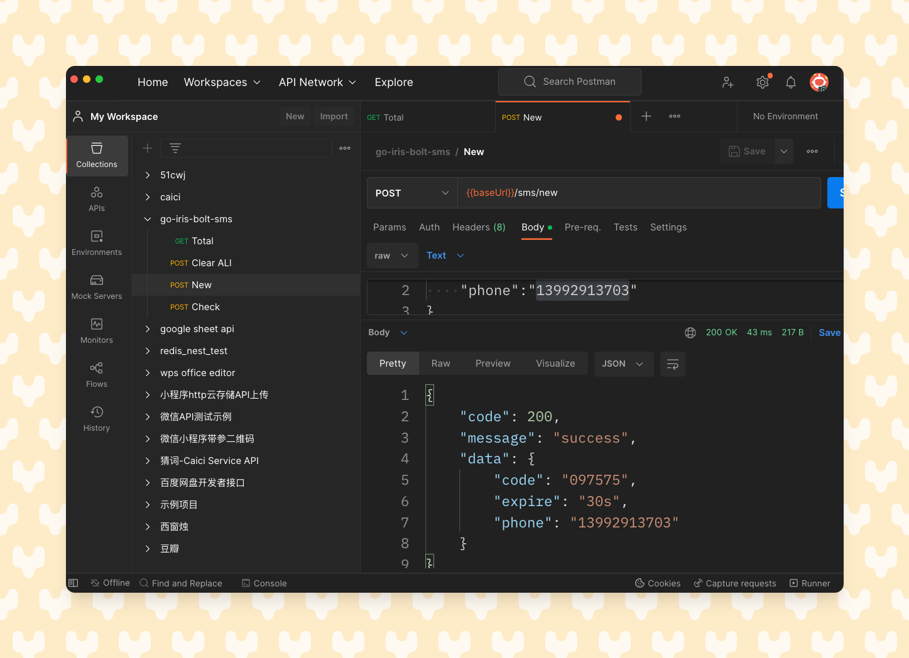

<p align='center'>
  
</p>

<p align='center'>
    基于iris和blot的短信验证码服务
</p>

<br>

<p align='center'>
<a href="https://wasm-calc.netlify.app/">Serverless Demo</a>
</p>

<br>

<p align='center'>
简体中文
</p>

<br>


##  特点介绍
- ⚡️ [iris](https://www.iris-go.com/): 一个高性能、易用且功能强大的Go语言Web框架
- 🔎 [bolt](https://github.com/boltdb/bolt) 一个高效的、嵌入式的、持久化的键值存储数据库, 只是不想用太重的mysql和redis~
- 🦾 Golang, of course
- ☁️ Deploy on [serverless dev](http://www.devsapp.cn/application.html)
- 🔌[腾讯云SMS](https://console.cloud.tencent.com/smsv2): 换成其他的也没问题啦

<br>


## 本地开发
```bash
# 修改config.yaml
mv config.example.yaml config.yaml
go run main.go
```
